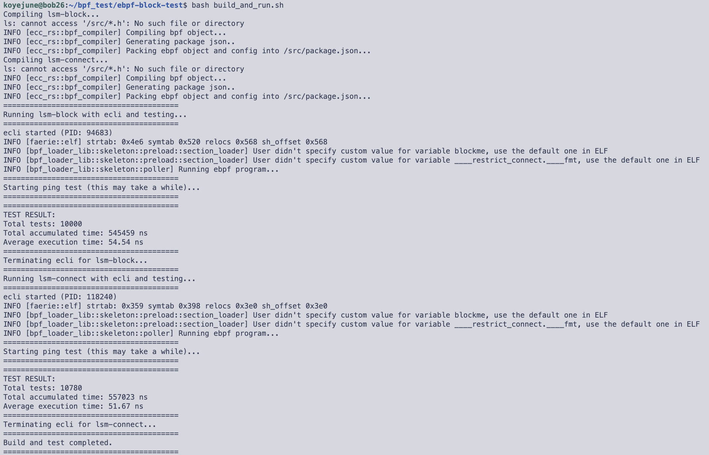

# Test eBPF Block Average Latency

## Prerequisites

Install ecli:

```bash
wget https://aka.pw/bpf-ecli -O ecli && chmod +x ./ecli
sudo mv ecli /usr/local/bin
```

## Compilation and Execution

```bash
bash build_and_run.sh
```

## Result


